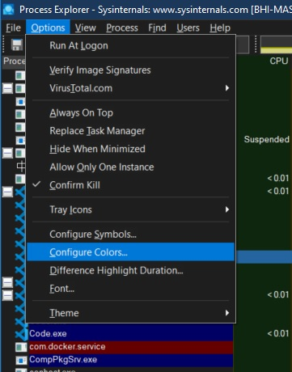
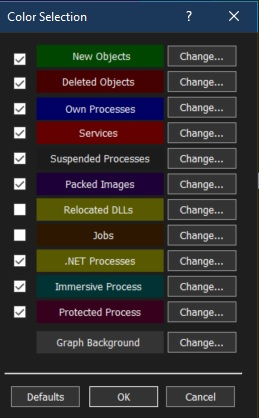
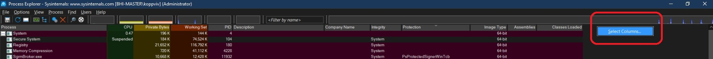
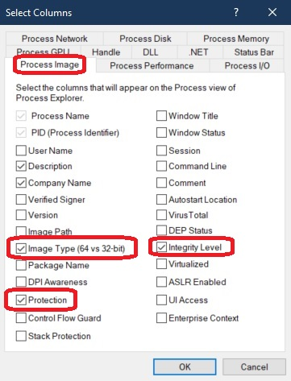

# Process Explorer Configuration

## Objective
1. Talks about some configurations that we can do to Process Explorer.

## Notes
1. Configure colors
   
    

2. And here is the color selection.

    

3. Select colomns as follows to the exlorer.

    

4. Select Columns as follows.

    

5. 