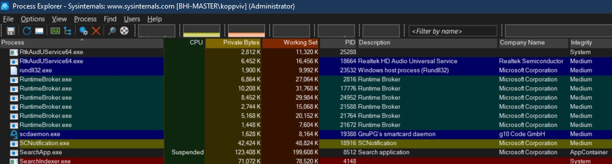
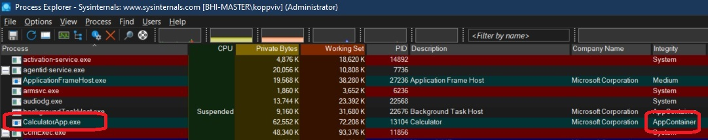

## Runtime Brokers
1. Talks about Runtime Brokers as well. Also AppContainers.

## Notes
1. Runtime Broker is an official Microsoft core process that debuted in Windows 8 and is still a part of Windows 10 and Windows 11. It is used to determine whether universal apps you got from the Microsoft Store --- which were called Metro apps in Windows 8 --- are declaring all of their permissions, like being able to access your location or microphone. Though it runs in the background all the time, you will likely see its activity rise when you launch a universal app. You can think of it like a middleman hooking your universal apps with the trust and privacy settings you've configured.

    

2. Helpers to Universal Windows Platform (UWP), and allow these UWP apps to do certain things which the uwp apps themseleves cannot do on their own. 
3. UWP processes run inside their own container called app containers.   
4. https://youtu.be/252epxxw4vY?t=690
5. Typical example of a Uwp app is calculator app. You can see the app container as follows.

    

6.  App container means very low integrity level. 
7.  AppContainers are the sanboxes typically used to run UWP processes (also known as metro, store, modern…). A process within an AppContainer runs with an Integrity Level of low, which effectively means it has no access to almost everything, as the default integrity level of objects (such as files) is Medium. This means code running inside an AppContainer can’t do any sigtnificant damage because of that lack of access.
8.  https://scorpiosoftware.net/2019/01/15/fun-with-appcontainers/