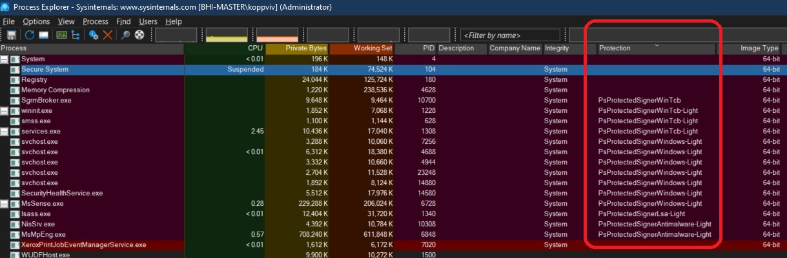

# Protected Processes in Process Explorer 

## Notes

1. Protected processes cannot be accessed invasively from user mode regardless of the user's privileges
   1. https://youtu.be/252epxxw4vY?t=745

   

2. You must run the Process explorer as an administrator. Else the above is not visible.

## References
1. https://itm4n.github.io/lsass-runasppl/
2. 