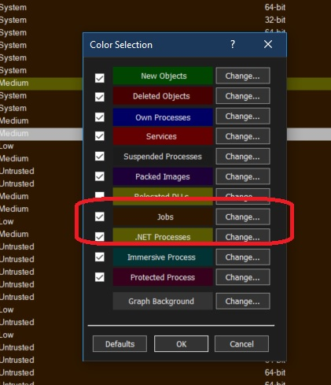

# Jobs intro.

## Notes
1. Process are Grouped into Jobs.
2. The purpose of job in general is to manage a set of processes as a unit. Then you can assign some limitations to that job, which will be applied to all of the process within that job.
3. Job entry can be color coded as follows.

    

4. Double click any job and you can see a contextual job tab as follows.

    

## References
1. https://youtu.be/252epxxw4vY?t=824