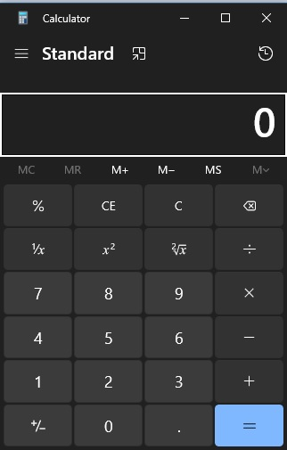
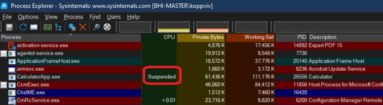

# Process Explorer Introduction

## Calculator
1. Start windows calculator.

   

2. In the Process explorer, find the entry for this.

   

3. Minimize the calc.

4. In the Process explorer, noteice that the app is suspended. 
   
5. For more info look at https://youtu.be/252epxxw4vY?t=600

6. I am not sure, but Windows runtime apps become suspended when they are minimized. And calc is a windows runtime app.

7. https://learn.microsoft.com/en-us/windows/uwp/cpp-and-winrt-apis/intro-to-using-cpp-with-winrt

